  

---

  

---

---

  

<table>
<tr>
<td>

</td>

<td>

</td>
</tr>
</table>

<table>
<tr>
<td>

</td>

<td>

</td>
</tr>
</table>

<table>
<tr>

<td>

</td>

<td>

</td>

</tr>
</table>

---

---

---

---

| Area | Details |
|---|---|
|  **Competitive Programming** | Codeforces, CSES, Leetcode |
|  **Backend Systems** | System design, APIs, performance |
|  **Low-level Programming** | C, C++, Rust, Linux |

---

  

---

<table>
<tr>
<td align="center" width="700">

 

 

 

</td>
</tr>
</table>

